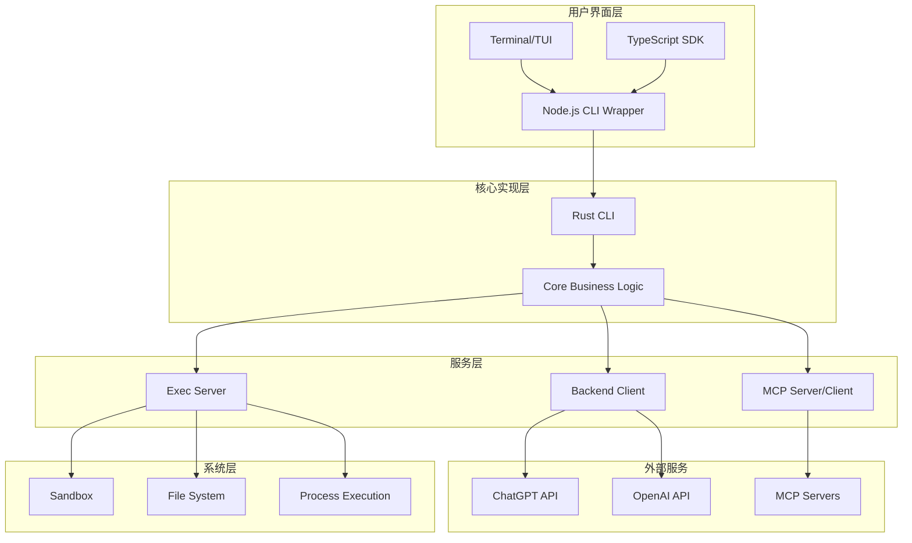
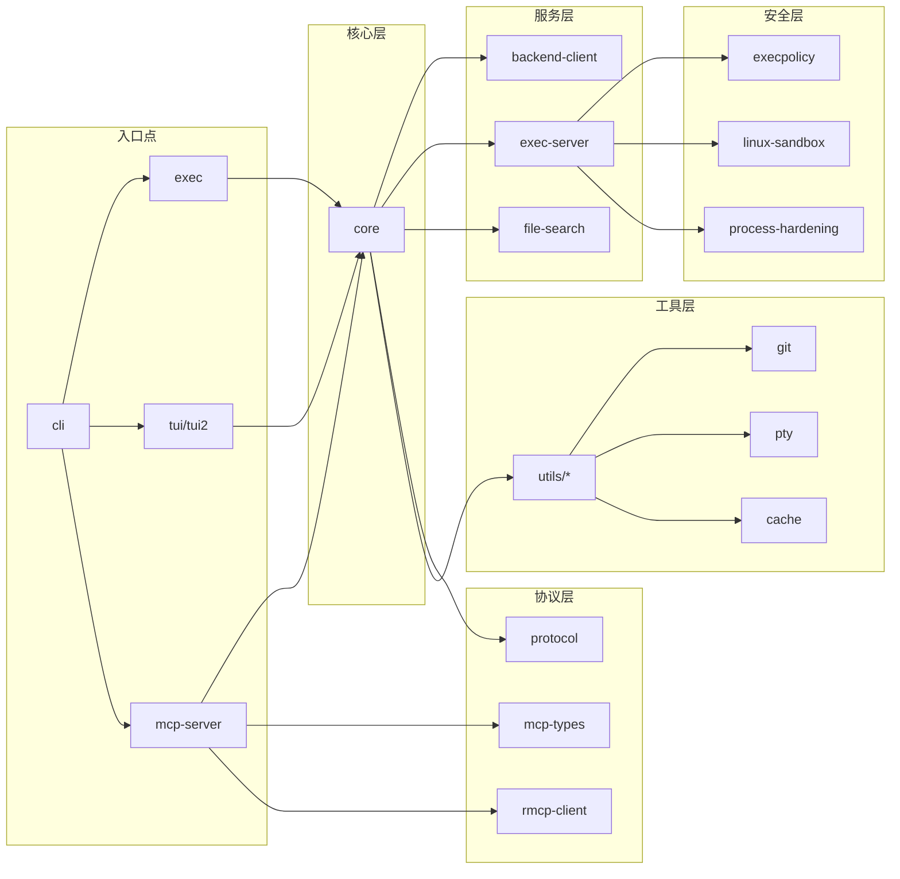
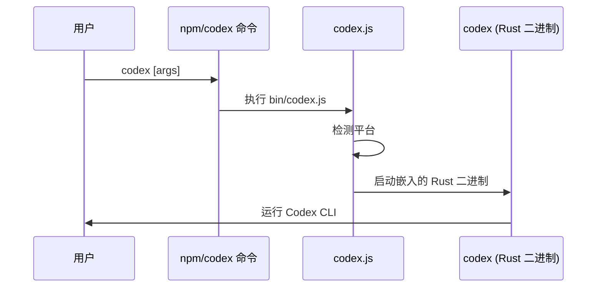
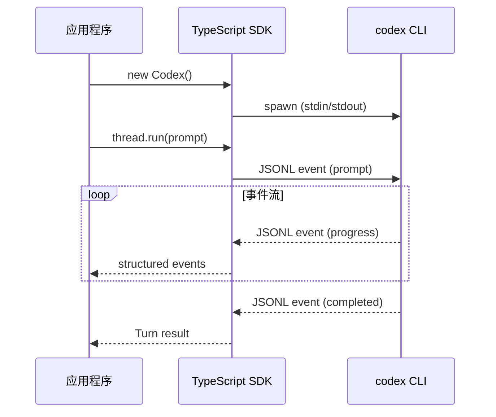
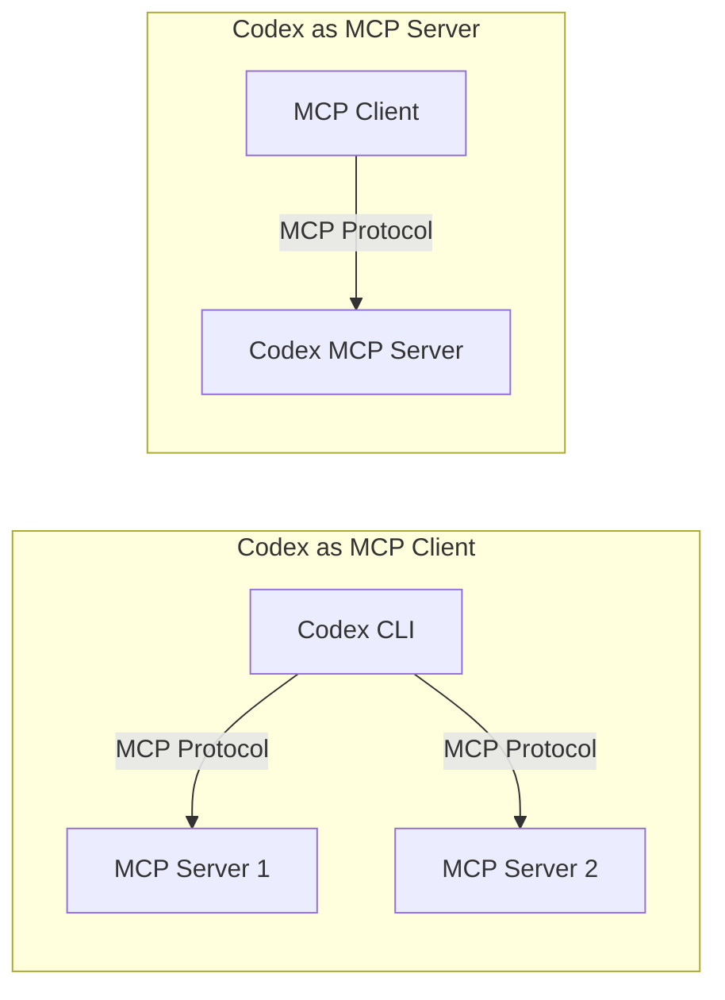
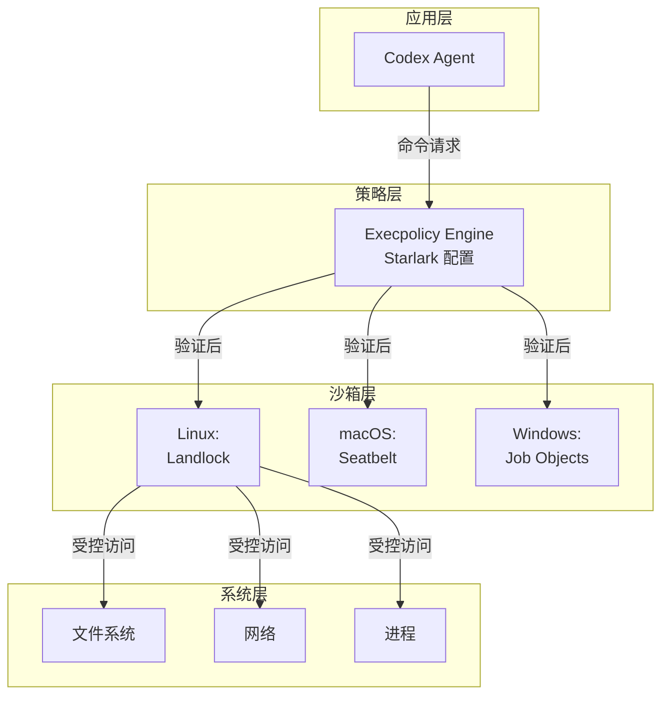
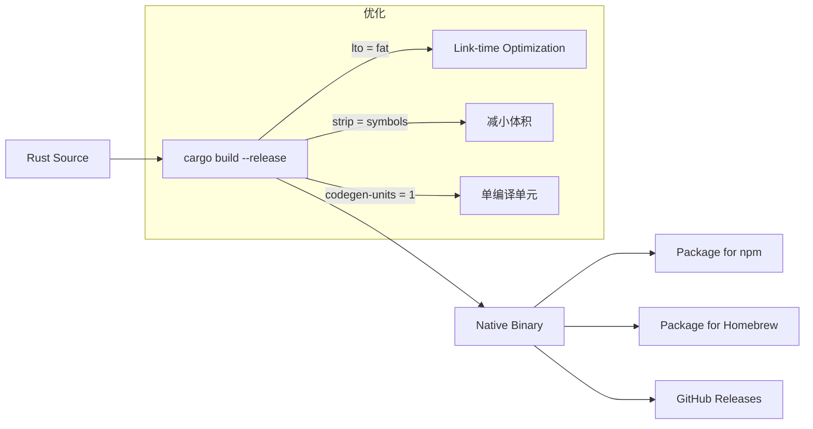
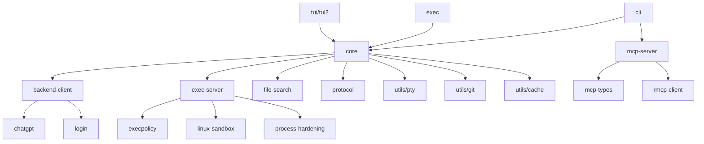

# OpenAI Codex CLI 架构分析文档

> 作者: Claude Code (GLM-4.7)
> 日期: 2025-12-27
> 来源: https://github.com/openai/codex

---

## 1. 项目概述

**Codex CLI** 是由 OpenAI 开发的轻量级代码代理（Coding Agent），在本地终端中运行。它通过与 OpenAI 的 ChatGPT 服务集成，提供智能代码编写、调试和自动化能力。

### 核心特性

- **本地运行**: 代理在本地计算机上运行，通过 ChatGPT 账户或 API 密钥与 OpenAI 服务通信
- **多语言支持**: Rust 核心实现 + TypeScript 包装层
- **零依赖安装**: 通过 npm 或 Homebrew 一键安装
- **MCP 协议支持**: 支持 Model Context Protocol，可作为客户端和服务器
- **沙箱执行**: 提供 macOS、Linux、Windows 平台的沙箱执行环境
- **交互式 TUI**: 基于 Ratatui 的全屏终端用户界面

---

## 2. 技术栈概览



| 层级 | 技术 | 用途 |
|------|------|------|
| UI 层 | Node.js, TypeScript | CLI 包装器、SDK |
| 核心层 | Rust (2024 Edition) | 业务逻辑、TUI |
| 通信层 | HTTP, WebSocket, JSONL | API 通信、事件流 |
| 系统层 | platform-specific | 沙箱、进程管理 |

---

## 3. 代码仓库结构

```
codex/
├── codex-cli/              # Node.js CLI 包装器
│   ├── bin/
│   │   ├── codex.js        # 主入口脚本
│   │   └── rg              # ripgrep 二进制文件
│   ├── package.json
│   └── scripts/
│
├── codex-rs/               # Rust 核心实现 (Cargo Workspace)
│   ├── Cargo.toml          # Workspace 配置 (50+ crates)
│   ├── core/               # 核心业务逻辑
│   ├── cli/                # CLI 多工具入口
│   ├── exec/               # 无头 CLI (自动化)
│   ├── tui/, tui2/         # 终端 UI 实现
│   ├── backend-client/     # OpenAI 后端客户端
│   ├── exec-server/        # 命令执行服务器
│   ├── mcp-server/         # MCP 服务器实现
│   ├── mcp-types/          # MCP 类型定义
│   ├── rmcp-client/        # Rust MCP 客户端
│   ├── execpolicy/         # 执行策略引擎
│   ├── login/              # 认证登录
│   ├── file-search/        # 文件搜索
│   ├── ansi-escape/        # ANSI 转义处理
│   ├── apply-patch/        # 补丁应用
│   ├── protocol/           # 通信协议定义
│   ├── app-server/         # 应用服务器 (IDE 集成)
│   └── utils/              # 工具库集合
│
├── sdk/typescript/         # TypeScript SDK
│   ├── README.md
│   └── package.json
│
├── docs/                   # 用户文档
│   ├── getting-started.md
│   ├── config.md
│   ├── authentication.md
│   ├── exec.md
│   ├── execpolicy.md
│   ├── advanced.md
│   └── faq.md
│
├── scripts/                # 构建和开发脚本
├── shell-tool-mcp/         # MCP shell 工具
└── third_party/            # 第三方依赖
```

---

## 4. Rust Workspace 模块架构

### 4.1 Workspace 概览

Codex CLI 的 Rust 部分是一个大型的 Cargo Workspace，包含 **50+ 个 crates**。这种模块化设计使得代码组织清晰、职责分离明确。



### 4.2 核心 Crate 详解

#### 4.2.1 `core/` - 核心业务逻辑

包含 Codex 代理的核心业务逻辑，设计为可复用的库 crate。

**职责**:
- 对话状态管理
- 工具调用编排
- 事件处理和分发
- 会话持久化

#### 4.2.2 `cli/` - CLI 多工具入口

提供所有 CLI 功能的统一入口点。

**子命令**:
- `codex` - 启动交互式 TUI
- `codex exec PROMPT` - 非交互式执行
- `codex mcp-server` - 启动 MCP 服务器
- `codex mcp` - MCP 管理命令
- `codex sandbox` - 沙箱测试命令

#### 4.2.3 `tui/` 和 `tui2/` - 终端用户界面

基于 [Ratatui](https://ratatui.rs/) 构建的全屏 TUI 实现。

**特性**:
- 两个版本并存（tui 和 tui2），可能在进行 UI 重构
- 支持 OSC 9 通知（macOS/Linux）
- WSL2 环境下自动回退到 Windows Toast 通知

**依赖**:
- `ratatui` - TUI 框架
- `crossterm` - 跨平台终端操作
- `ansi-to-tui` - ANSI 转 TUI 渲染

#### 4.2.4 `exec/` - 无头 CLI

用于自动化和非交互式执行。

**用途**:
- CI/CD 集成
- GitHub Actions
- 脚本自动化

#### 4.2.5 `backend-client/` - 后端通信客户端

负责与 OpenAI 后端服务的通信。

**功能**:
- ChatGPT API 调用
- OpenAI API 调用
- SSE 事件流处理
- 认证管理

#### 4.2.6 `exec-server/` - 命令执行服务器

处理命令的执行和管理。

**职责**:
- 命令执行
- 输出捕获
- 进程生命周期管理
- 与沙箱集成

#### 4.2.7 `execpolicy/` - 执行策略引擎

实现 Starlark 配置的策略执行规则。

**特性**:
- 声明式策略定义
- 命令白名单/黑名单
- 文件访问控制
- 网络访问控制

#### 4.2.8 `mcp-server/` 和 `mcp-types/` - MCP 协议支持

实现 Model Context Protocol。

**功能**:
- Codex 作为 MCP 客户端连接到其他 MCP 服务器
- Codex 作为 MCP 服务器供其他客户端使用
- 工具发现和调用
- 资源访问

#### 4.2.9 认证相关

| Crate | 职责 |
|-------|------|
| `login/` | ChatGPT 账户登录 |
| `keyring-store/` | 系统密钥环集成 |
| `chatgpt/` | ChatGPT 认证流程 |

#### 4.2.10 沙箱相关

| Crate | 平台 |
|-------|------|
| `linux-sandbox/` | Linux (Landlock) |
| `windows-sandbox-rs/` | Windows |
| `process-hardening/` | 进程安全强化 |

#### 4.2.11 工具库集合 (`utils/`)

```
utils/
├── absolute-path/    # 绝对路径处理
├── cache/            # 缓存实现
├── cargo-bin/        # Cargo 二进制工具
├── git/              # Git 操作
├── image/            # 图像处理
├── json-to-toml/     # JSON 转 TOML
├── pty/              # 伪终端
├── readiness/        # 就绪检查
└── string/           # 字符串工具
```

---

## 5. Node.js CLI 层

### 5.1 结构

`codex-cli/` 目录包含 Node.js 包装器，主要用于：

1. **跨平台分发**: 通过 npm 统一安装体验
2. **二进制嵌入**: 内嵌平台特定的 Rust 二进制文件
3. **入口适配**: 提供统一的 `codex` 命令入口

### 5.2 package.json 分析

```json
{
  "name": "@openai/codex",
  "version": "0.0.0-dev",
  "license": "Apache-2.0",
  "bin": {
    "codex": "bin/codex.js"    // 主入口
  },
  "type": "module",
  "engines": {
    "node": ">=16"
  },
  "files": [
    "bin",                     // 包含入口脚本
    "vendor"                   // 包含嵌入的二进制文件
  ]
}
```

### 5.3 工作流程



---

## 6. TypeScript SDK

### 6.1 概述

SDK 允许开发者将 Codex 代理嵌入到自己的应用和工作流中。

### 6.2 通信机制

SDK 通过 **stdin/stdout** 与 Codex CLI 二进制进行 **JSONL 事件流** 通信：



### 6.3 API 设计

```typescript
// 基本用法
const codex = new Codex();
const thread = codex.startThread();
const turn = await thread.run("Implement feature X");

// 流式响应
const { events } = await thread.runStreamed("Analyze code");
for await (const event of events) {
  // 处理结构化事件
}

// 结构化输出
const schema = { type: "object", properties: { ... } };
const turn = await thread.run("Summarize", { outputSchema: schema });

// 附加图片
await thread.run([
  { type: "text", text: "Describe this" },
  { type: "local_image", path: "./screenshot.png" }
]);
```

---

## 7. 通信协议

### 7.1 JSONL 事件流

Codex CLI 使用 **JSONL (JSON Lines)** 格式进行事件通信：

```
{"type": "item.started", "item": {...}}
{"type": "item.completed", "item": {...}}
{"type": "turn.started", "turn": {...}}
{"type": "turn.completed", "turn": {...}}
```

### 7.2 MCP 协议

Codex 支持 **Model Context Protocol (MCP)**：

1. **作为客户端**: 连接到外部 MCP 服务器，调用工具
2. **作为服务器**: 暴露 Codex 能力给其他 MCP 客户端



---

## 8. 安全架构

### 8.1 多层沙箱



### 8.2 执行策略 (Execpolicy)

使用 **Starlark** 配置语言定义策略：

```python
# 示例策略配置
def allow_command(command):
    # 只允许只读命令
    if command in ["git status", "git diff", "ls", "cat"]:
        return True
    return False

def allow_file_access(path, mode):
    # 只允许工作目录内的写操作
    if mode == "write" and not path.startswith("/workspace"):
        return False
    return True
```

### 8.3 沙箱模式

| 模式 | 描述 |
|------|------|
| `read-only` | 默认，只读访问，无网络 |
| `workspace-write` | 允许工作目录内写入，无网络 |
| `danger-full-access` | 完全访问（仅限容器环境） |

---

## 9. 配置系统

### 9.1 配置文件位置

- **配置文件**: `~/.codex/config.toml`
- **会话存储**: `~/.codex/sessions/`

### 9.2 主要配置项

```toml
# 沙箱模式
sandbox_mode = "read-only"  # read-only | workspace-write | danger-full-access

# MCP 服务器
[mcp_servers.example]
command = "/path/to/server"
args = ["--port", "3000"]

# 通知
[notify]
command = "/usr/bin/terminal-notifier"
args = ["-title", "Codex", "-message", "{{message}}"]

# 模型配置
[models]
default = "gpt-4o"
```

---

## 10. 构建和发布

### 10.1 构建流程



### 10.2 平台支持

| 平台 | 架构 | 二进制名称 |
|------|------|-----------|
| macOS | ARM64 (Apple Silicon) | `codex-aarch64-apple-darwin` |
| macOS | x86_64 | `codex-x86_64-apple-darwin` |
| Linux | x86_64 | `codex-x86_64-unknown-linux-musl` |
| Linux | ARM64 | `codex-aarch64-unknown-linux-musl` |

### 10.3 Release Profile

```toml
[profile.release]
lto = "fat"           # 链接时优化
strip = "symbols"     # 移除符号表
codegen-units = 1     # 单编译单元，优化体积
```

---

## 11. 依赖关系

### 11.1 主要外部依赖

| 依赖 | 版本 | 用途 |
|------|------|------|
| `tokio` | 1 | 异步运行时 |
| `ratatui` | 0.29 | TUI 框架 |
| `crossterm` | 0.28 | 终端操作 |
| `reqwest` | 0.12 | HTTP 客户端 |
| `serde` | 1 | 序列化/反序列化 |
| `clap` | 4 | CLI 参数解析 |
| `tracing` | 0.1 | 日志追踪 |
| `starlark` | 0.13 | 策略配置语言 |
| `tree-sitter` | 0.25 | 代码解析 |

### 11.2 内部依赖图



---

## 12. 开发者工作流

### 12.1 本地开发

```bash
# Rust 开发
cd codex-rs
cargo build
cargo test
cargo clippy

# Node.js 开发
cd codex-cli
npm install
npm run format

# 运行开发版本
cargo run --bin cli
```

### 12.2 测试

```bash
# 单元测试
cargo test

# CI 测试配置
[profile.ci-test]
debug = 1
inherits = "test"
opt-level = 0
```

---

## 13. 架构亮点

### 13.1 语言选择

- **Rust 核心实现**: 性能、内存安全、零依赖分发
- **TypeScript 包装**: 生态系统集成、SDK 开发
- **Starlark 配置**: 安全、可表达、声明式策略

### 13.2 模块化设计

- 50+ crates 的 Cargo Workspace
- 清晰的职责分离
- 可复用的库设计

### 13.3 多种使用模式

1. **交互式 TUI**: 日常开发使用
2. **无头模式**: CI/CD 自动化
3. **SDK 集成**: 嵌入第三方应用
4. **MCP 协议**: 工具互操作性

### 13.4 安全优先

- 多层沙箱保护
- 声明式执行策略
- 进程安全强化
- Zero Data Retention (ZDR) 支持

---

## 14. 与本项目的关系

### 14.1 作为 Git 子模块

```
./vendors/codex  -->  https://github.com/openai/codex
```

这个仓库作为本项目的第三方依赖参考，可以用于：

1. **学习参考**: 了解如何构建 AI 编程代理
2. **集成使用**: 将 Codex CLI 集成到项目工作流
3. **MCP 服务器**: 为 Codex 提供自定义 MCP 工具

### 14.2 潜在应用场景

- **自动化代码审查**: 使用 `codex exec` 在 CI/CD 中运行
- **文档生成**: 集成到项目的文档生成流程
- **MCP 工具开发**: 开发针对本项目的 MCP 服务器

---

## 15. 总结

OpenAI Codex CLI 是一个设计精良的 AI 编程代理系统，其架构体现了以下原则：

1. **性能优先**: Rust 核心实现确保快速执行和低资源占用
2. **安全第一**: 多层沙箱和声明式策略保护系统安全
3. **用户友好**: 交互式 TUI 和多种安装方式
4. **可扩展性**: MCP 协议和 SDK 支持第三方集成
5. **模块化**: 50+ crates 的清晰分离

该架构对于构建类似的 AI Agent 系统具有很高的参考价值。

---

## 附录

### A. 相关资源

- [GitHub 仓库](https://github.com/openai/codex)
- [官方文档](https://github.com/openai/codex/tree/main/docs)
- [MCP 协议规范](https://modelcontextprotocol.io/)
- [Ratatui 文档](https://ratatui.rs/)

### B. 关键文件索引

| 文件/目录 | 描述 |
|----------|------|
| `codex-rs/core/` | 核心业务逻辑 |
| `codex-rs/cli/` | CLI 入口点 |
| `codex-rs/tui/` | TUI 实现 |
| `codex-rs/exec-server/` | 命令执行服务器 |
| `codex-rs/mcp-server/` | MCP 服务器实现 |
| `codex-rs/Cargo.toml` | Workspace 配置 |
| `codex-cli/bin/codex.js` | Node.js 入口 |
| `sdk/typescript/` | TypeScript SDK |
| `docs/` | 用户文档 |

---

*文档版本: 1.0*
*最后更新: 2025-12-27*
