# OpenAI Codex CLI 深度架构分析文档

> 作者: Claude Code (GLM-4.7)
> 日期: 2025-12-27
> 来源: https://github.com/openai/codex
> 版本: 基于源码深度分析

---

## 目录

1. [项目概述](#1-项目概述)
2. [整体架构](#2-整体架构)
3. [代码组织结构](#3-代码组织结构)
4. [核心模块深度分析](#4-核心模块深度分析)
5. [CLI 命令系统](#5-cli-命令系统)
6. [通信协议](#6-通信协议)
7. [执行与沙箱](#7-执行与沙箱)
8. [配置系统](#8-配置系统)
9. [MCP 协议实现](#9-mcp-协议实现)
10. [依赖关系图](#10-依赖关系图)
11. [构建与发布](#11-构建与发布)
12. [设计模式与最佳实践](#12-设计模式与最佳实践)
13. [总结](#13-总结)

---

## 1. 项目概述

**Codex CLI** 是 OpenAI 开发的本地 AI 编程代理，通过与 ChatGPT 服务集成提供智能代码辅助能力。

### 1.1 核心价值主张

| 特性 | 描述 |
|------|------|
| **本地运行** | 代理在本地执行，保护代码隐私 |
| **零依赖安装** | 单一二进制文件，无需额外依赖 |
| **多模态交互** | TUI 交互、非交互式执行、SDK 集成 |
| **安全沙箱** | 多平台沙箱保护系统安全 |
| **MCP 支持** | Model Context Protocol 协议支持 |

### 1.2 技术选型理由

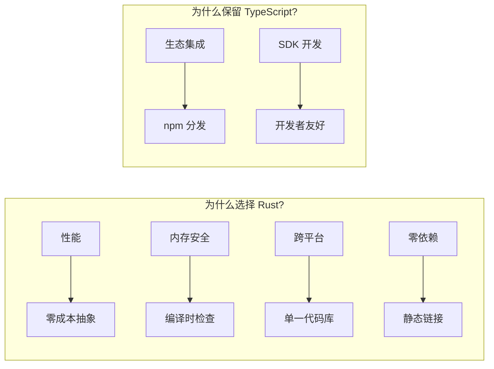

---

## 2. 整体架构

### 2.1 分层架构图

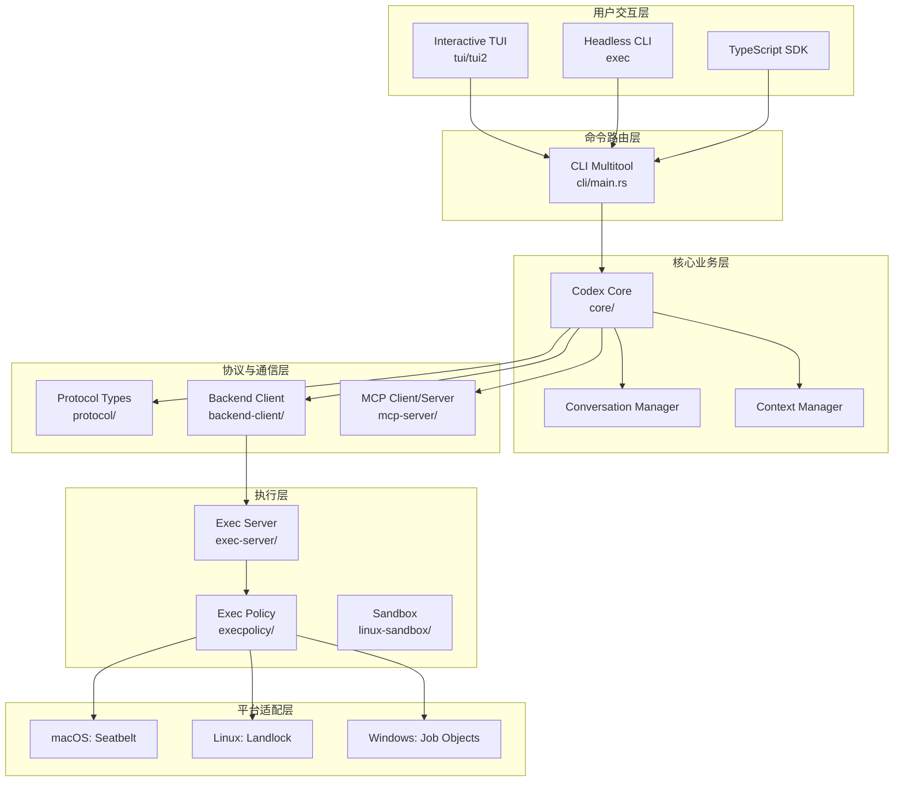

### 2.2 数据流图

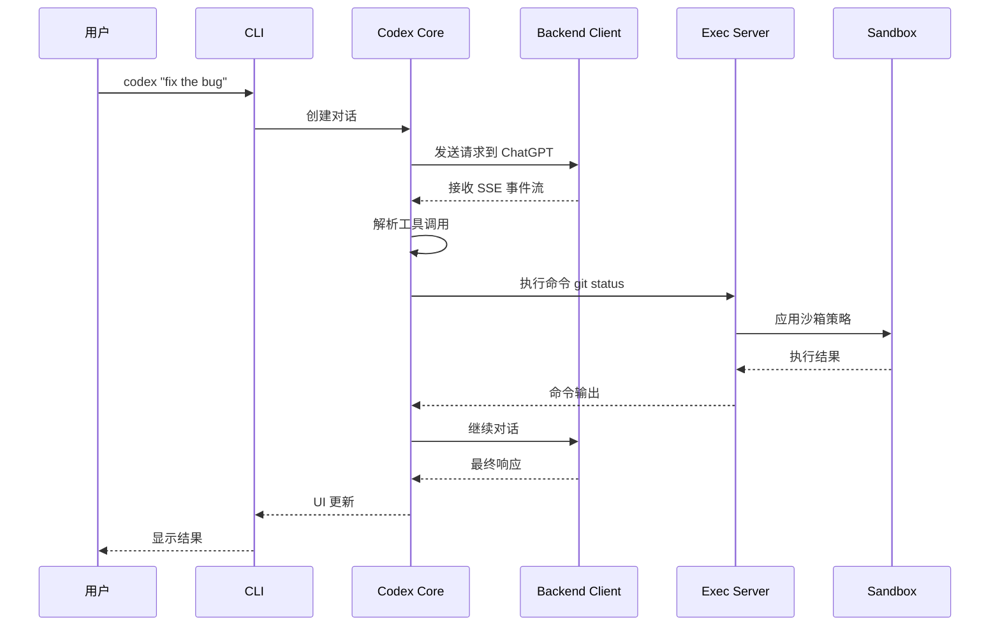

---

## 3. 代码组织结构

### 3.1 仓库树状图

```
codex2/
├── codex-cli/                      # Node.js 包装层
│   ├── bin/codex.js               # npm 入口
│   └── package.json
│
├── codex-rs/                       # Rust Workspace (49 crates)
│   ├── Cargo.toml                 # Workspace 配置
│   │
│   ├── cli/                       # [CLI 入口] 命令路由
│   │   ├── src/main.rs           # 主入口，所有子命令
│   │   ├── src/lib.rs
│   │   ├── src/login.rs          # 登录流程
│   │   └── src/mcp_cmd.rs        # MCP 子命令
│   │
│   ├── core/                      # [核心业务] 代理逻辑
│   │   ├── src/
│   │   │   ├── codex.rs          # 138KB - 主代理逻辑
│   │   │   ├── client.rs         # 模型客户端
│   │   │   ├── conversation_manager.rs
│   │   │   ├── context_manager/
│   │   │   ├── config/           # 配置加载
│   │   │   ├── auth/             # 认证管理
│   │   │   ├── mcp/              # MCP 集成
│   │   │   ├── tools/            # 内置工具
│   │   │   ├── parse_command.rs  # 30KB - 命令解析
│   │   │   ├── git_info.rs       # 40KB - Git 上下文
│   │   │   ├── exec_policy.rs    # 33KB - 执行策略
│   │   │   ├── terminal.rs       # 38KB - 终端处理
│   │   │   ├── shell.rs          # Shell 交互
│   │   │   └── ...
│   │
│   ├── protocol/                  # [协议定义] 通信类型
│   │   ├── src/
│   │   │   ├── types.rs          # 协议类型
│   │   │   ├── client.rs         # 客户端定义
│   │   │   └── lib.rs
│   │
│   ├── backend-client/           # [后端通信] OpenAI API
│   │   ├── src/
│   │   │   ├── types.rs          # 后端类型定义
│   │   │   └── lib.rs
│   │
│   ├── exec-server/              # [执行服务] 命令执行
│   │   ├── src/
│   │   │   ├── lib.rs
│   │   │   └── bin/
│   │   │       ├── main_execve_wrapper.rs
│   │   │       └── main_mcp_server.rs
│   │
│   ├── mcp-server/               # [MCP 服务器] 协议实现
│   │   ├── src/lib.rs           # MCP 主入口
│   │   ├── src/message_processor.rs
│   │   └── src/codex_tool_runner.rs
│   │
│   ├── mcp-types/                # MCP 类型定义
│   ├── rmcp-client/              # Rust MCP 客户端
│   │
│   ├── execpolicy/               # [执行策略] Starlark 策略引擎
│   ├── linux-sandbox/            # Linux Landlock 沙箱
│   ├── process-hardening/        # 进程安全强化
│   │
│   ├── tui/                      # TUI v1 实现
│   ├── tui2/                     # TUI v2 实现 (实验)
│   ├── exec/                     # 非交互式执行
│   │
│   ├── codex-api/                # OpenAI API 客户端
│   │   ├── src/
│   │   │   ├── endpoint/         # API 端点
│   │   │   ├── sse/              # SSE 事件流
│   │   │   └── rate_limits.rs    # 速率限制
│   │
│   ├── chatgpt/                  # ChatGPT 认证客户端
│   ├── login/                    # 登录管理
│   ├── keyring-store/            # 系统密钥环
│   │
│   ├── file-search/              # 文件搜索工具
│   ├── ansi-escape/              # ANSI 转义处理
│   ├── apply-patch/              # 补丁应用
│   │
│   ├── app-server/               # 应用服务器 (IDE 集成)
│   ├── app-server-protocol/      # 应用服务器协议
│   │
│   ├── lmstudio/                 # LM Studio 集成
│   ├── ollama/                   # Ollama 集成
│   │
│   └── utils/                    # 工具库集合
│       ├── git/
│       ├── pty/                  # 伪终端
│       ├── cache/
│       ├── image/
│       └── ...
│
├── sdk/typescript/               # TypeScript SDK
├── docs/                         # 用户文档
└── scripts/                      # 构建脚本
```

### 3.2 Workspace 统计

| 指标 | 数值 |
|------|------|
| **总 Crates** | 49 |
| **核心业务** | ~20,000 LOC (core/src/codex.rs) |
| **Rust Edition** | 2024 |
| **外部依赖** | 100+ crates |

---

## 4. 核心模块深度分析

### 4.1 CLI 入口 (`cli/src/main.rs`)

这是所有命令的统一入口点，使用 `clap` 解析器。

#### 子命令架构

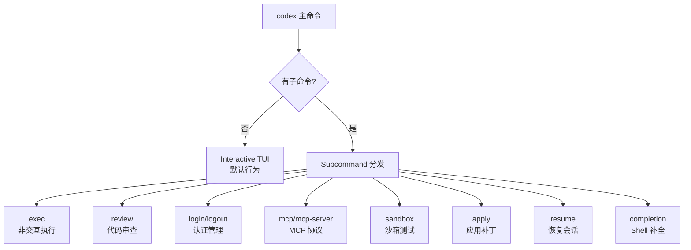

#### 关键代码结构

```rust
// main.rs 核心结构
#[derive(Debug, Parser)]
struct MultitoolCli {
    #[clap(flatten)]
    pub config_overrides: CliConfigOverrides,

    #[clap(flatten)]
    pub feature_toggles: FeatureToggles,

    #[clap(flatten)]
    interactive: TuiCli,  // 默认交互式 TUI

    #[clap(subcommand)]
    subcommand: Option<Subcommand>,
}

#[derive(Debug, clap::Subcommand)]
enum Subcommand {
    Exec(ExecCli),           // codex exec
    Review(ReviewArgs),      // codex review
    Login(LoginCommand),     // codex login
    Logout(LogoutCommand),   // codex logout
    Mcp(McpCli),             // codex mcp
    McpServer,               // codex mcp-server
    Sandbox(SandboxArgs),    // codex sandbox
    Apply(ApplyCommand),     // codex apply
    Resume(ResumeCommand),   // codex resume
    // ...
}
```

### 4.2 Codex Core (`core/src/codex.rs`)

这是整个系统的核心，包含 ~138KB 的业务逻辑。

#### 模块结构

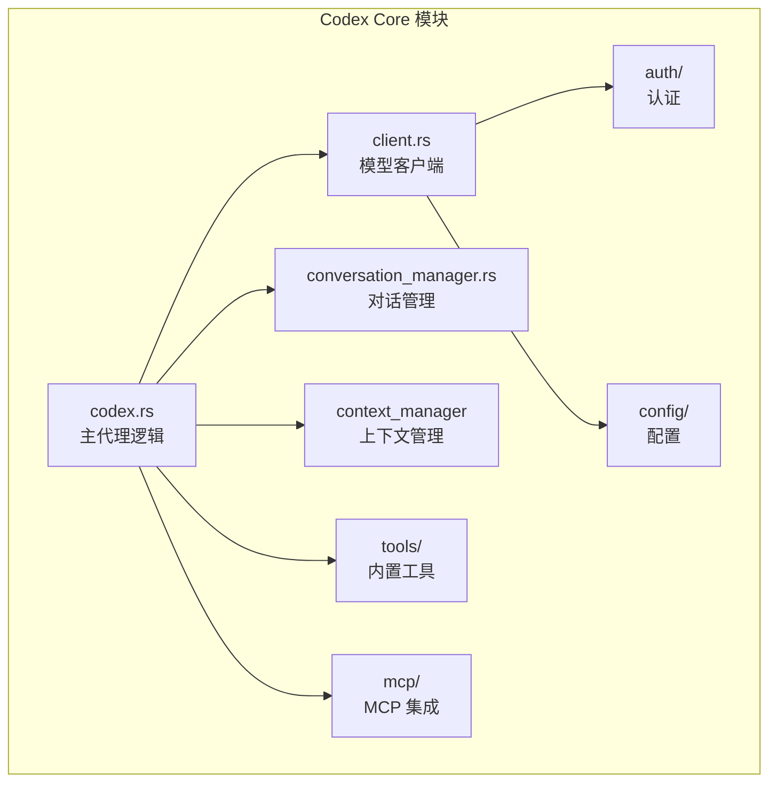

#### 核心类型

```rust
// core/src/lib.rs 导出的核心类型
pub use codex_protocol::protocol::InitialHistory;
pub use conversation_manager::ConversationManager;
pub use auth::AuthManager;
pub use client::ModelClient;
pub use codex_protocol::models::ContentItem;
pub use codex_protocol::models::LocalShellAction;
pub use codex_protocol::models::ResponseItem;
```

### 4.3 协议层 (`protocol/src/types.rs`)

定义客户端与后端通信的协议类型。

#### 协议依赖

```toml
[dependencies]
codex-git = { workspace = true }
codex-utils-absolute-path = { workspace = true }
codex-utils-image = { workspace = true }
mcp-types = { workspace = true }
mime_guess = { workspace = true }
serde = { workspace = true, features = ["derive"] }
serde_json = { workspace = true }
ts-rs = { workspace = true }  # TypeScript 类型生成
uuid = { workspace = true, features = ["serde", "v7", "v4"] }
```

### 4.4 后端客户端 (`backend-client/`)

负责与 OpenAI 后端服务的通信。

#### 类型定义 (`types.rs`)

```rust
// 后端响应类型
pub struct CodeTaskDetailsResponse {
    pub current_user_turn: Option<Turn>,
    pub current_assistant_turn: Option<Turn>,
    pub current_diff_task_turn: Option<Turn>,
}

pub struct Turn {
    pub id: Option<String>,
    pub input_items: Vec<TurnItem>,
    pub output_items: Vec<TurnItem>,
    pub worklog: Option<Worklog>,
    pub error: Option<TurnError>,
}
```

### 4.5 执行服务器 (`exec-server/`)

处理命令的执行和沙箱管理。

#### 二进制目标

```toml
[[bin]]
name = "codex-execve-wrapper"
path = "src/bin/main_execve_wrapper.rs"

[[bin]]
name = "codex-exec-mcp-server"
path = "src/bin/main_mcp_server.rs"
```

---

## 5. CLI 命令系统

### 5.1 命令层次结构

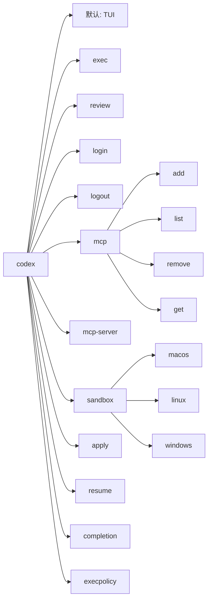

### 5.2 主要命令说明

| 命令 | 描述 | 用途 |
|------|------|------|
| `codex` | 启动交互式 TUI | 日常开发 |
| `codex exec PROMPT` | 非交互式执行 | CI/CD 自动化 |
| `codex review` | 代码审查 | PR 检查 |
| `codex login` | 登录 ChatGPT | 认证 |
| `codex mcp add` | 添加 MCP 服务器 | 工具扩展 |
| `codex mcp-server` | 启动 MCP 服务器 | 作为工具 |
| `codex sandbox linux` | 测试沙箱 | 调试 |

---

## 6. 通信协议

### 6.1 协议层次

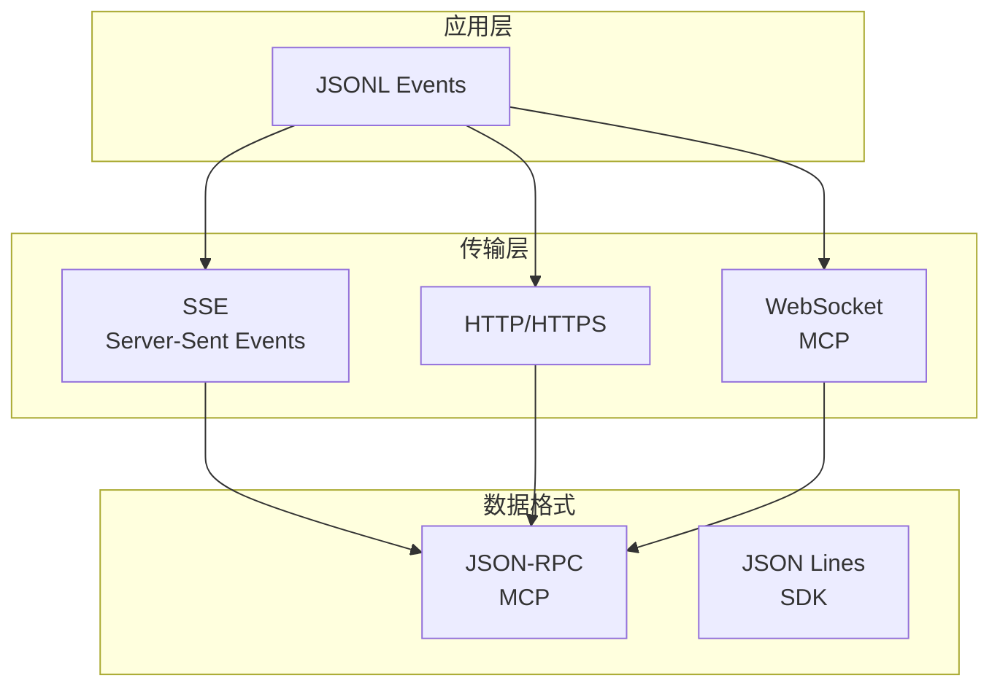

### 6.2 JSONL 事件流格式

```jsonl
{"type": "turn.started", "turn_id": "uuid"}
{"type": "item.started", "item": {"type": "shell"}}
{"type": "item.completed", "item": {...}}
{"type": "turn.completed", "turn": {...}}
```

### 6.3 MCP 协议实现

#### MCP Server (`mcp-server/src/lib.rs`)

```rust
pub async fn run_main(
    codex_linux_sandbox_exe: Option<PathBuf>,
    cli_config_overrides: CliConfigOverrides,
) -> IoResult<()> {
    // 设置通道
    let (incoming_tx, mut incoming_rx) = mpsc::channel::<JSONRPCMessage>(128);
    let (outgoing_tx, mut outgoing_rx) = mpsc::unbounded_channel::<OutgoingMessage>();

    // 任务: 从 stdin 读取
    let stdin_reader_handle = tokio::spawn(async move {
        while let Some(line) = lines.next_line().await.unwrap_or_default() {
            let msg = serde_json::from_str::<JSONRPCMessage>(&line)?;
            incoming_tx.send(msg).await?;
        }
    });

    // 任务: 处理消息
    let processor_handle = tokio::spawn(async move {
        while let Some(msg) = incoming_rx.recv().await {
            match msg {
                JSONRPCMessage::Request(r) => processor.process_request(r).await,
                JSONRPCMessage::Response(r) => processor.process_response(r).await,
                JSONRPCMessage::Notification(n) => processor.process_notification(n).await,
            }
        }
    });

    // 任务: 写入 stdout
    let stdout_writer_handle = tokio::spawn(async move {
        while let Some(outgoing_message) = outgoing_rx.recv().await {
            let json = serde_json::to_string(&outgoing_message)?;
            stdout.write_all(json.as_bytes()).await?;
            stdout.write_all(b"\n").await?;
        }
    });
}
```

---

## 7. 执行与沙箱

### 7.1 执行架构

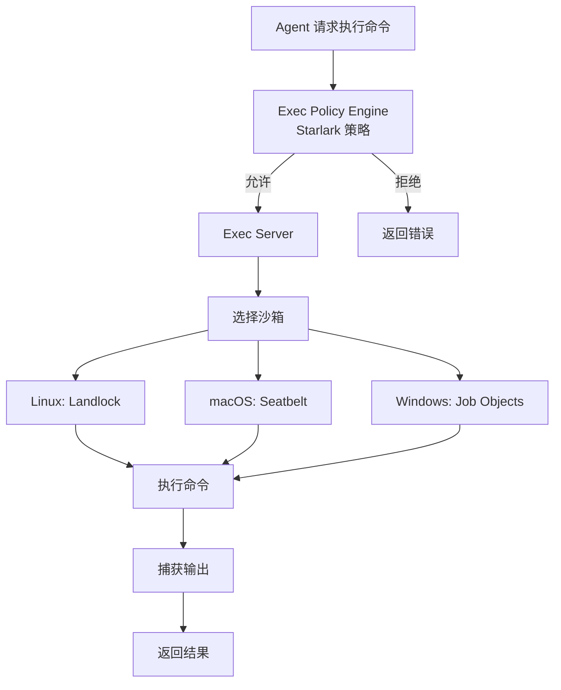

### 7.2 沙箱实现

| 平台 | 技术 | Crate |
|------|------|-------|
| **Linux** | Landlock | `linux-sandbox/` |
| **macOS** | Seatbelt | `core/src/seatbelt.rs` |
| **Windows** | Job Objects | `windows-sandbox-rs/` |

### 7.3 执行策略 (Execpolicy)

使用 **Starlark** 配置语言定义策略：

```python
# 示例策略
def allow_command(command):
    # 只允许只读命令
    safe_commands = ["git status", "git diff", "ls", "cat"]
    return command in safe_commands

def allow_file_access(path, mode):
    # 只允许工作目录内的写操作
    workspace = "/workspace"
    if mode == "write":
        return path.startswith(workspace)
    return True
```

---

## 8. 配置系统

### 8.1 配置优先级

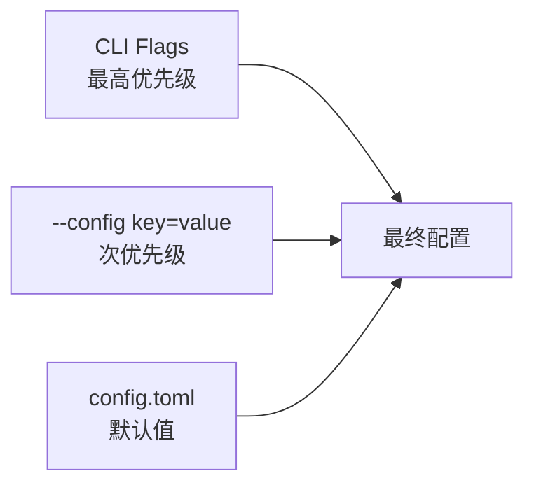

### 8.2 配置文件位置

- **配置**: `$CODEX_HOME/config.toml` (默认 `~/.codex/config.toml`)
- **会话**: `$CODEX_HOME/sessions/`
- **日志**: `$CODEX_HOME/logs/`

### 8.3 配置结构

```toml
# 模型配置
model = "gpt-5.1"
model_provider = "openai"

# 模型提供商
[model_providers.openai]
name = "OpenAI"
base_url = "https://api.openai.com/v1"
wire_api = "chat"

# 功能开关
[features]
unified_exec = false
apply_patch_freeform = false
view_image_tool = true
web_search_request = false
skills = false

# 沙箱模式
sandbox_mode = "read-only"  # read-only | workspace-write | danger-full-access

# MCP 服务器
[mcp_servers.example]
command = "/path/to/server"
args = ["--port", "3000"]

# 执行策略
[shell_environment_policy]
include_only = ["PATH", "HOME", "USER"]

# 通知
[notify]
command = "/usr/bin/terminal-notifier"
args = ["-title", "Codex", "-message", "{{message}}"]
```

---

## 9. MCP 协议实现

### 9.1 MCP 架构

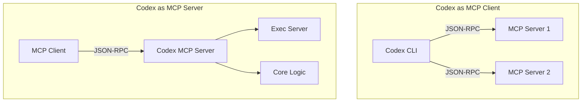

### 9.2 MCP 类型系统 (`mcp-types/`)

```rust
// mcp-types/src/lib.rs
pub use jsonrpc_core::{types::*, ...};

// MCP 核心类型
pub struct JSONRPCMessage {
    // JSON-RPC 2.0 消息定义
}
```

### 9.3 Rust MCP Client (`rmcp-client/`)

基于 `rmcp` crate 实现 MCP 客户端功能。

---

## 10. 依赖关系图

### 10.1 核心依赖关系

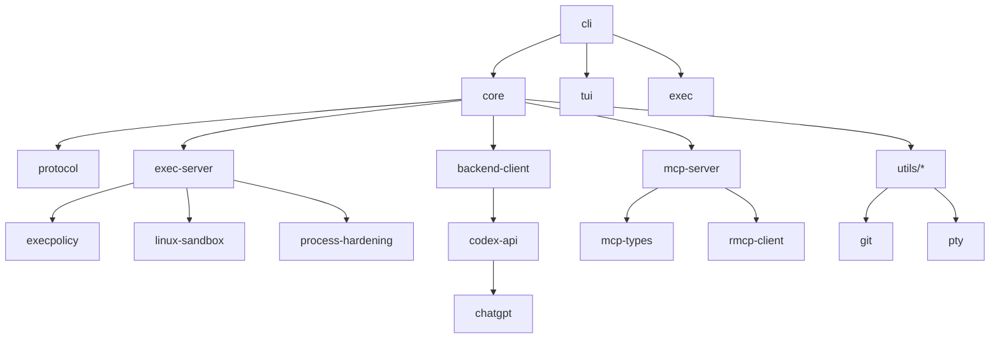

### 10.2 外部依赖 (部分)

| 依赖 | 版本 | 用途 |
|------|------|------|
| `tokio` | 1 | 异步运行时 |
| `ratatui` | 0.29 | TUI 框架 |
| `crossterm` | 0.28 | 终端操作 |
| `reqwest` | 0.12 | HTTP 客户端 |
| `serde` | 1 | 序列化 |
| `clap` | 4 | CLI 解析 |
| `tracing` | 0.1 | 日志 |
| `starlark` | 0.13 | 策略配置 |
| `rmcp` | 0.12 | MCP 协议 |

---

## 11. 构建与发布

### 11.1 Release Profile

```toml
[profile.release]
lto = "fat"              # 链接时优化
strip = "symbols"        # 移除符号表
codegen-units = 1        # 单编译单元
```

### 11.2 构建产物

| 平台 | 架构 | 产物名称 |
|------|------|----------|
| macOS | ARM64 | `codex-aarch64-apple-darwin` |
| macOS | x86_64 | `codex-x86_64-apple-darwin` |
| Linux | x86_64 | `codex-x86_64-unknown-linux-musl` |
| Linux | ARM64 | `codex-aarch64-unknown-linux-musl` |

### 11.3 分发渠道

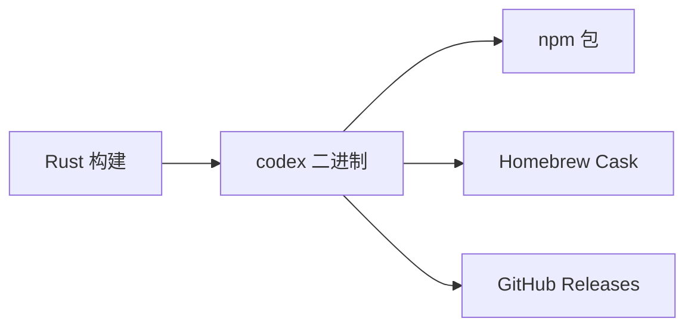

---

## 12. 设计模式与最佳实践

### 12.1 架构模式

| 模式 | 应用位置 | 描述 |
|------|----------|------|
| **Workspace Pattern** | Cargo Workspace | 49 个独立 crates |
| **分层架构** | 整体架构 | 清晰的职责分离 |
| **策略模式** | Exec Policy | Starlark 策略引擎 |
| **适配器模式** | MCP/Model Providers | 多协议适配 |
| **观察者模式** | SSE 事件流 | 实时事件更新 |

### 12.2 代码组织原则

1. **单一职责**: 每个 crate 有明确的单一职责
2. **依赖倒置**: 核心逻辑不依赖具体实现
3. **接口隔离**: 使用 trait 定义清晰接口
4. **开闭原则**: 通过配置和 MCP 扩展功能

### 12.3 错误处理

```rust
// 使用 anyhow 和 thiserror
pub use anyhow::Result<T>;
pub use thiserror::Error;

#[derive(Error, Debug)]
pub enum CodexError {
    #[error("API error: {0}")]
    ApiError(String),

    #[error("Execution policy error: {0}")]
    ExecPolicyError(String),
}
```

---

## 13. 总结

### 13.1 架构优势

1. **性能与安全**: Rust 核心提供高性能和内存安全
2. **模块化设计**: 49 个 crates 实现清晰分离
3. **跨平台支持**: 统一代码库支持多平台
4. **可扩展性**: MCP 协议支持第三方工具
5. **安全优先**: 多层沙箱保护

### 13.2 可借鉴的设计

| 方面 | 可借鉴点 |
|------|----------|
| **Workspace 组织** | 大型 Rust 项目的模块化方案 |
| **CLI 架构** | 多命令行工具的统一入口设计 |
| **配置系统** | 分层配置优先级管理 |
| **执行策略** | Starlark DSL 实现声明式策略 |
| **MCP 集成** | 标准协议实现工具互操作性 |

### 13.3 潜在应用场景

- **自动化工具**: 借鉴其命令执行和沙箱设计
- **AI Agent 系统**: 参考其对话管理和工具调用架构
- **多平台 CLI**: 学习其跨平台抽象和分发策略

---

## 附录

### A. 关键文件索引

| 文件 | 描述 | LOC |
|------|------|-----|
| `cli/src/main.rs` | CLI 入口 | ~500 |
| `core/src/codex.rs` | 核心代理逻辑 | ~4000 |
| `core/src/parse_command.rs` | 命令解析 | ~900 |
| `core/src/git_info.rs` | Git 上下文 | ~1200 |
| `core/src/exec_policy.rs` | 执行策略 | ~1000 |
| `mcp-server/src/lib.rs` | MCP 服务器 | ~500 |

### B. 参考资料

- [GitHub 仓库](https://github.com/openai/codex)
- [MCP 协议规范](https://modelcontextprotocol.io/)
- [Ratatui 文档](https://ratatui.rs/)
- [Starlark 语言](https://github.com/bazelbuild/starlark)

---

*文档版本: 2.0 (深度源码分析版)*
*最后更新: 2025-12-27*
